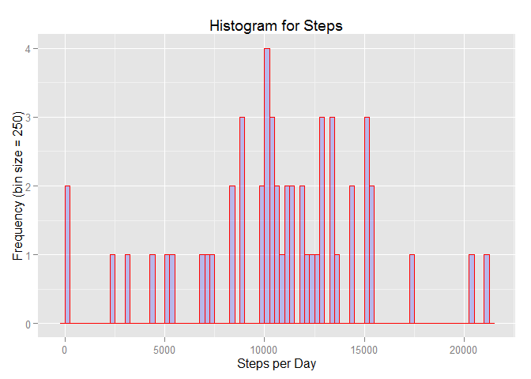

# Reproducible Research: Peer Assessment 1
Scott Bedard  
November 15, 2015  


## Loading and preprocessing the data

```r
data <- read.csv("activity.csv")
stepsPerDay <- summarise(group_by(data, date), steps=sum(steps))
```


## What is mean total number of steps taken per day?

```r
q <- qplot(stepsPerDay$steps, geom="histogram",binwidth = 250,  
           main = "Histogram for Steps", 
           xlab = "Steps per Day",
           ylab = "Frequency (bin size = 250)",
           fill=I("blue"), 
           col=I("red"), 
           alpha=I(.2))
```
 

```r
meanSPD <- round(mean(stepsPerDay$steps, na.rm=TRUE), 3)
medianSPD <- round(median(stepsPerDay$steps, na.rm=TRUE), 3)
```

**Mean Steps Per Day** = 10766.189  
**Median Steps Per Day** = 10765  

## What is the average daily activity pattern?

```r
stepsPerTimeInterval <- data[c("steps","interval")] %>% group_by(interval) %>% summarise_each(funs(mean(., na.rm = TRUE)))
g <- ggplot(stepsPerTimeInterval, aes(interval, steps)) + 
    geom_line() +
    xlab("5-minute interval") +
    ylab("Avg number of steps taken")
```
 

```r
maxIntervalSteps <- max(stepsPerTimeInterval$steps)
maxInterval <- stepsPerTimeInterval[stepsPerTimeInterval$steps==maxIntervalSteps,]$interval
```

**The maximum average steps in one interval is 206.17 at interval 835**  

## Imputing missing values

```r
numNA <- sum(is.na(data$steps))
```

**There are 2304 rows that have no step data.** 

###Impute a new data set using the mean of the interval as a replacement value for NA###

```r
dataMerge <- merge(data, stepsPerTimeInterval, by="interval", all.x=TRUE)
dataMerge$steps.x[is.na(dataMerge$steps.x)] = as.integer(dataMerge$steps.y[is.na(dataMerge$steps.x)])
dataImputed <- dataMerge[order(dataMerge$date,dataMerge$interval),c("steps.x", "interval", "date")]
stepsPerDayImputed <- summarise(group_by(dataImputed, date), steps=sum(steps.x))
```


```r
qImputed <- qplot(stepsPerDayImputed$steps, geom="histogram",binwidth = 100,  
           main = "Histogram for Imputed Steps", 
           xlab = "Steps per Day",
           ylab = "Frequency (bin size = 250)",
           fill=I("blue"), 
           col=I("red"), 
           alpha=I(.2))
```
 

```r
meanSPDImputed <- round(mean(stepsPerDayImputed$steps), 3)
medianSPDImputed <- median(stepsPerDayImputed$steps)
```

**Mean Steps Per Day** = 10749.77 (Originally 10766.189)   
**Median Steps Per Day** = 10641 (Originally 10765)    

**Do these values differ from the estimates from the first part of the assignment?**   
The values differ very minimally. 

**What is the impact of imputing missing data on the estimates of the total daily number of steps?**  
There is not much impact imputing the missing data using the interval mean. 

## Are there differences in activity patterns between weekdays and weekends?


```r
dataImputed$dateType <-  ifelse(as.POSIXlt(dataImputed$date)$wday %in% c(0,6), 'weekend', 'weekday')

stepsIntervaleDateType <- dataImputed[c("steps.x","interval", "dateType")] %>% group_by(interval, dateType) %>% summarise_each(funs(mean(., na.rm = TRUE)))

gDateType = ggplot(data=stepsIntervaleDateType, aes(x=interval, y=steps.x)) +
    geom_line() +
    facet_grid(dateType ~ ., scales="free") +
    xlab("5-minute interval") +
    ylab("Avg number of steps taken") 
```
 

**It appears there is more activity on the weekend especially during the daylight hours.**

